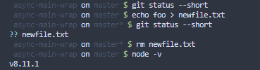
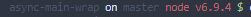

# bash prompt



My bash prompt has been with me for years, but I didn't build it myself. I
[started out with a copy](https://github.com/gustavnikolaj/dotfiles/blob/f5bdd165f21be2b601482cbe2c87ce6da96e17bb/bash/.bash_prompt)
from [paulirish/dotfiles](https://github.com/paulirish/dotfiles) - which at the
top of the file mentions that it was based on a copy of the prompt from
[gf3/dotfiles](https://github.com/gf3/dotfiles).

## Installation

Source the [prompt.sh](./prompt.sh) file in your `.bashrc` file.

## Walkthrough

At it's most basic, the prompt will just show you the basename of your current
working directory. If you're in `$HOME`:

```
 ~ $
```

If you're in `/home/gustav/Projects`:

```
 Projects $
```

I prefer the prompt not getting too long, so I don't show the whole path in
there - but just enough of it that I get an idea of where I am at.

### git

If the directory your in is part of a git repo, the prompt will show you what
branch you're currently on:

```
 my-project on master $
```

```
 my-project on feature/new-stuff $
```

If the status of the git repo is unclean, the refname will have an asterisk
tagged onto it.

```
 my-project on feature/new-stuff $ echo 'foo bar' > newfile.txt
 my-project on feature/new-stuff* $
```

### node versions

If you are in a folder with a `.nvmrc` file, the prompt will show the node
version as part of the prompt in red text, if the node version is not the one
listed in `.nvmrc`.

```
 my-project $ node -v
6.0.0
 my-project $ echo 8.11.3 > .nvmrc
 my-project node v6.9.4 $ nvm use
Now using node v8.11.3
 myproject $
```



The node version is ONLY displayed when the active node.js version is not the
same as the one listed in `.nvmrc`.

### root

If you get a super user shell, the indicator will change from a friendly green
`$` to a red and scary `#`.

```
 foo $ sudo -s
 foo #
```

